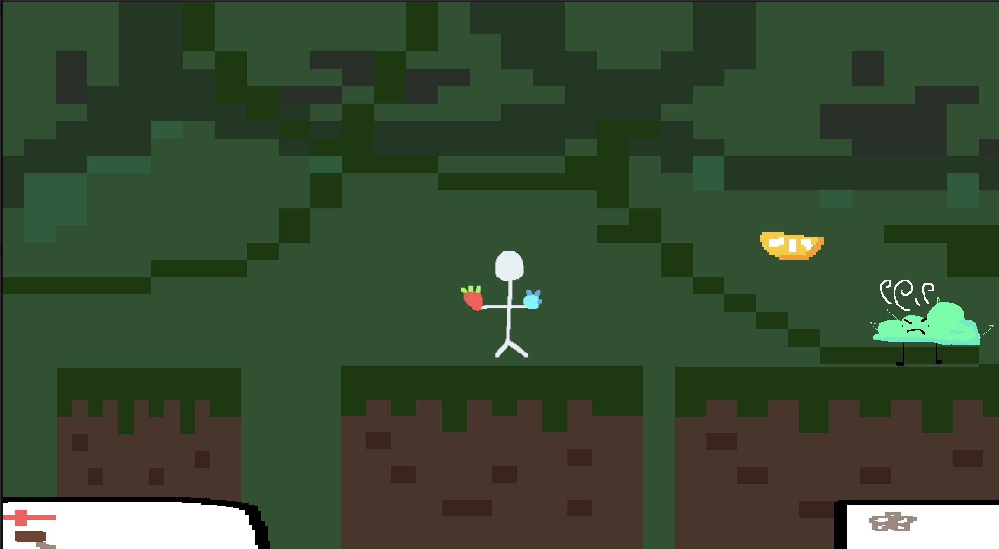

## Orbital Planterium

Orbital Planterium is a 2D pixel art platformer where a character's rocket crashes and they explore 
different planets collecting plants and battling enemies. The three scenes each represent snippets of that 
storyline with different mechanics including bounce physics, collectibles, trigger 
interactions, and sound effects.

# Contributions
Avelyne – Scene 1 and Scene 2 (player movement, pickaxe interaction, bounce mechanics, collectibles, sound fx)
William – Scene 3 (light effect, platform movement, transportation) , camera movement, and scene transitions
